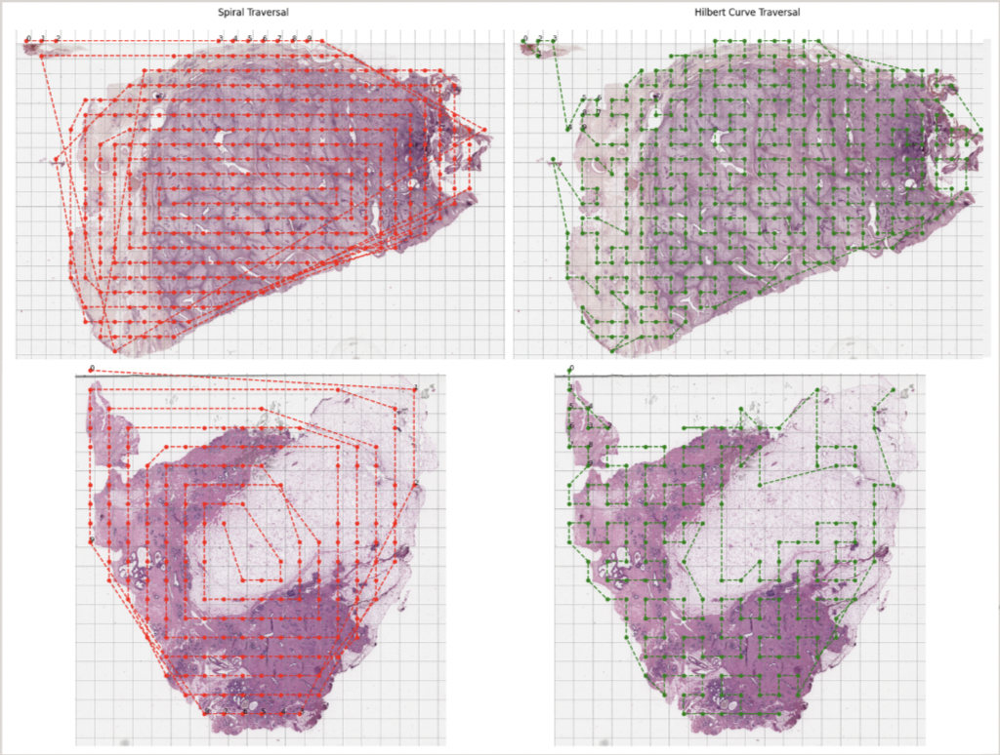
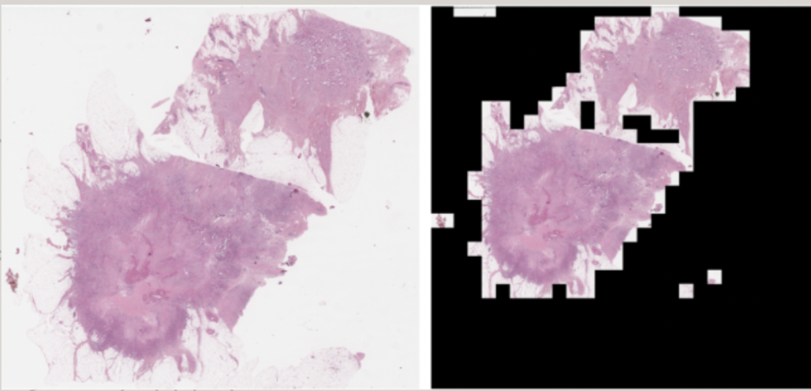
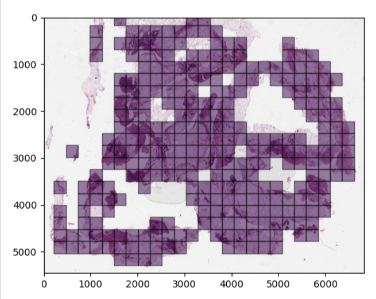
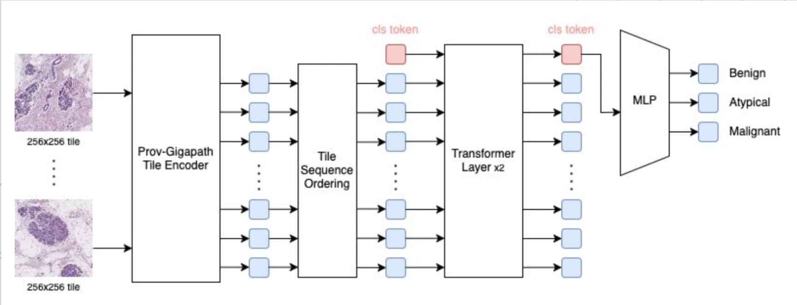

# Spatial Encoding Techniques for Breast Histopathology Classification with Vision Transformers

This repository contains the code and research implementation for **Vision Transformer (ViT)-based classification of breast histopathology Whole Slide Images (WSIs)** using **spatial encoding strategies**.  
Our work explores the impact of **tile ordering methods** and **positional encoding techniques** on the performance of ViT models for breast cancer subtype classification using the **BRACS dataset**. 

[Read the Project Report](Spatial%20Encoding%20Techniques%20for%20Vision%20Transformer-Based%20Breast%20Histopathology%20Classification.pdf)

## Overview

Breast histopathology diagnosis from Whole Slide Images (WSIs) requires models that capture both **local structures** and **global spatial context**. **Vision Transformers (ViTs)** can leverage **self-attention** to capture long-range dependencies, but their performance is highly influenced by **positional encodings**.

This project:

- Evaluates **tile ordering strategies**: 
  - **Raster scan**  
  - **Spiral traversal**  
  - **Hilbert curve (space-filling curve)**
 

   
  <em>Tile Traversal Techniques</em>

- Tests **positional encoding methods**:
  - **1D sinusoidal encoding**  
  - **2D sinusoidal encoding**  
  - **Relative positional encoding (RPE)**
- Uses **Prov-GigaPath embeddings** for tile feature extraction.
- Achieves **state-of-the-art improvements** over BRACS baseline, particularly for the **challenging atypical cases**.

## Dataset

**[BRACS Dataset](https://doi.org/10.1093/database/baac093)**  
- 547 WSIs, H&E stained, annotated into **Benign**, **Atypical**, and **Malignant** classes.  
- Tiles extracted at **256×256 resolution, 10× (level 2) magnification**.  
- We account for class imbalance addressed via **focal loss with class weighting**.

| Split       | Benign | Atypical | Malignant | Total WSIs |
|------------|--------|---------|----------|-----------|
| Train      | 203    | 52      | 140      | 395       |
| Validation | 30     | 14      | 21       | 67        |
| Test       | 32     | 23      | 32       | 85        |

## Project Pipeline

1. **Tile Extraction**  
   - Non-overlapping 256×256 tiles generated.  
   - Background removed via luminance threshold.

  
  &nbsp;&nbsp;&nbsp;&nbsp; 
  

  <em>Left: WSI Before & After Tiling   |   Right: Tiled Whole Slide Image</em>

2. **Feature Embedding Generation**  
   - Extracted using **Prov-GigaPath** (1536-dim per tile).  

3. **Tile Ordering & Positional Encoding**  
   - Raster, spiral, Hilbert curve traversal.  
   - 1D/2D sinusoidal & relative positional encodings.

4. **Classification with ViT**  
   - Custom ViT with 2 transformer layers, 3 attention heads.  
   - 3-class output: **Benign / Atypical / Malignant**.

   
  <em>Proposed Model Architecture</em>

5. **Evaluation**  
   - Metrics: **Accuracy, Macro Precision, Recall, F1-score**  
   - Confusion matrices for class-level analysis.
     
# Citation (Important!)

  - If you use this code, please cite:
@article{karagoz2025spatialvit,
  title={Spatial Encoding Techniques for Breast Histopathology Classification with Vision Transformers},
  author={İrem Damla Karagöz and Selim Aksoy},
  year={2025},
  institution={Bilkent University},
}

